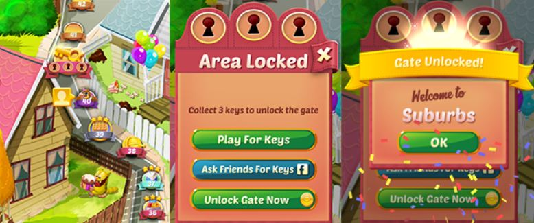

# Проект Cookie Cats

## Оглавление:

[1. Описание проекта.](#1-описание-проекта) 
[2. Какой кейс решаем?](#2-какой-кейс-решаем) 
[3. Краткая информация о данных.](#3-краткая-информация-о-данных) 
[4. Этапы работы над проектом.](#4-этапы-работы-над-проектом) 
[5. Использованные инструменты и библиотеки.](#5-использованные-инструменты-и-библиотеки) 

### 1. Описание проекта.

A/B-тестирование мобильной игры Cookie Cat.   

⬆️[К оглавлению](#оглавление)

### 2. Какой кейс решаем?

Cookie Cats — это классическая игра-головоломка в стиле «соедини три», в которой игрок должен соединять плитки одного цвета, чтобы очистить игровое поле и выиграть уровень.

По мере прохождения уровней игры игроки время от времени сталкиваются с воротами, которые заставляют их ждать некоторое количество времени или совершать покупки в приложении для продвижения. Помимо стимулирования покупок в приложении, эти ворота служат важной цели: дать игрокам вынужденный перерыв в игре, что должно привести к увеличению и продлению удовольствия игрока от игры.

Изначально первые ворота были размещены на уровне 30. Далее был проведен эксперимент, в котором первые ворота в Cookie Cats переместили с уровня 30 на уровень 40. 

Наша задача: исследовать полученные результаты и дать рекомендации, на каком уровне устанавливать ворота. 

⬆️[К оглавлению](#оглавление)

### 3. Краткая информация о данных.

Датасет взят на Kaggle.com и представляет собой [набор данных](https://www.kaggle.com/datasets/mursideyarkin/mobile-games-ab-testing-cookie-cats) о 90 189 игроках, которые установили игру во время проведения AB-теста.  

* `userid` - уникальный идентификационный номер игрока.
* `version` - принадлежность игрока к контрольной группе gate_30 или к группе с новым расположением ворот (тестовой) gate_40.
* `sum_gamerounds` - количество игровых раундов, сыгранных игроком в течение первых 14 дней после установки.
* `retention_1`- вернулся ли игрок в первый день после регистрации.
* `retention_7`- вернулся ли игрок на седьмой день после регистрации.

⬆️[К оглавлению](#оглавление)

### 4. Этапы работы над проектом.
1. Предварительный анализ данных.
2. Анализ результатов A/B-тестирования.
3. Общие выводы.
 

⬆️[К оглавлению](#оглавление)

### 5. Использованные инструменты и библиотеки.
* pandas (2.2.1) 
* numpy (1.26.4) 
* matplotlib (3.8.3)
* seaborn (0.13.2) 
* pingouin (0.5.4) 

⬆️[К оглавлению](#оглавление)